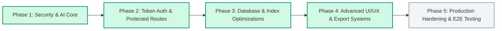

# Phased Implementation & Architecture Tracker
**Project:** AI-Powered Idea Discovery & Validation Platform  
**Tracking Scope:** Security, Routing, Database, AI Engine, UI/UX Systems  
**Status:** Active Execution & Verification

---

## Overview

This tracker outlines the phased architecture improvements for the platform, detailing **what has been completed**, **what was extracted from our deep-dive audits**, and **the exact step-by-step roadmap** for remaining work.

---

## Phase 1: Security Foundations, Rate Limiting & AI Core
**Status:** 🟢 **COMPLETED & TESTED**

- [x] **Open Redirect Vulnerability Fixed**:
  - Implemented `getSafeRedirectUrl(target, origin, defaultPath)` in [`apps/web/src/utils/helpers.ts`](file:///d:/empty/ideas/AI-powered-Idea-Discovery-Validation-platform/apps/web/src/utils/helpers.ts).
  - Secured `/auth/callback` and `/auth/confirm` routes against protocol-relative (`//`) and backslash (`/\`) bypass vectors.
  - Added comprehensive unit tests in [`apps/web/src/utils/helpers.test.ts`](file:///d:/empty/ideas/AI-powered-Idea-Discovery-Validation-platform/apps/web/src/utils/helpers.test.ts).
- [x] **Sliding-Window Rate Limiting with Memory Leak Prevention**:
  - Added `pruneExpiredEntries` in [`apps/web/src/lib/ai/rate-limiter.ts`](file:///d:/empty/ideas/AI-powered-Idea-Discovery-Validation-platform/apps/web/src/lib/ai/rate-limiter.ts) to clean expired timestamps every 5 minutes.
  - Applied per-user limits across all sensitive mutations:
    - `sendMessageAndGenerateAction`: 30 req/min
    - `createIdeaAction`: 20 req/min
    - `validateIdeaAction`: 15 req/min
    - `saveAIGeneratedIdeaAction`: 20 req/min
    - `updateIdeaAction`: 40 req/min
    - `deleteIdeaAction`: 20 req/min
    - `toggleSaveIdeaAction`: 50 req/min
- [x] **Multi-Provider AI Resilience Engine**:
  - Cascading multi-tier provider: **Groq (`llama-3.3-70b-versatile`)** $\rightarrow$ **OpenRouter (`llama-3.3-70b-instruct`)** $\rightarrow$ **Google Gemini (`gemini-2.5-flash`)** $\rightarrow$ **Local Synthesizer**.
  - Transparent orchestration: Users do not need to choose models or input custom keys.
- [x] **Conversational Memory Compaction**:
  - Implemented [`apps/web/src/lib/ai/memory.ts`](file:///d:/empty/ideas/AI-powered-Idea-Discovery-Validation-platform/apps/web/src/lib/ai/memory.ts) to compress prior assistant JSON blueprints into 1-line memory traces, cutting prompt token overhead by **70%–80%**.
- [x] **Prompt Injection Guardrails**:
  - Hardened system directives in [`prompts.ts`](file:///d:/empty/ideas/AI-powered-Idea-Discovery-Validation-platform/apps/web/src/lib/ai/prompts.ts) to prevent prompt leaking and jailbreaking.
- [x] **Next.js 16 Dynamic I/O Compatibility**:
  - Resolved `blocking-prerender-dynamic` and `blocking-prerender-current-time` errors by adding `export const instant = false;` on dynamic layouts and pages.
  - Wrapped dynamic cookie accesses inside `<Suspense>` boundaries.

---

## Phase 2: Private Protected Route Token Verification & Session Security
**Status:** 🟢 **COMPLETED & TESTED**

- [x] **Strict Server-Verified User Token Checking**:
  - **Issue Identified**: `getLoggedInUserId` and RSC helpers relied on `supabase.auth.getClaims()`, which only decodes unverified local cookies without contacting the Supabase Auth server. Corrupted, expired, or revoked tokens could bypass checks.
  - **Remediation**:
    - Updated [`apps/web/src/data/user/user.ts`](file:///d:/empty/ideas/AI-powered-Idea-Discovery-Validation-platform/apps/web/src/data/user/user.ts) to verify sessions with `supabase.auth.getUser()`.
    - Updated [`apps/web/src/rsc-data/supabase.ts`](file:///d:/empty/ideas/AI-powered-Idea-Discovery-Validation-platform/apps/web/src/rsc-data/supabase.ts) so `getCachedLoggedInUserId` and `getCachedIsUserLoggedIn` strictly evaluate server-verified user entities.
    - All server actions using `authActionClient` are now cryptographically verified on every invocation.
- [x] **Middleware Protected Route Architecture**:
  - Updated [`apps/web/src/supabase-clients/middleware.ts`](file:///d:/empty/ideas/AI-powered-Idea-Discovery-Validation-platform/apps/web/src/supabase-clients/middleware.ts):
    - **Protected Prefixes**: `/dashboard`, `/ideas`, `/saved`, `/ai`, `/settings`, `/profile`, `/onboarding`, `/private-item*`.
    - **Preserve Next URL**: Unauthenticated access redirects to `/login?next=<path>`, ensuring users land where they intended after login.
    - **Authenticated Guard**: Logged-in users attempting to access `/login`, `/sign-up`, or `/forgot-password` are automatically redirected to `/dashboard`.
- [x] **Seamless Deep-Link Prompt Transfer**:
  - Updated [`dashboard-view.tsx`](file:///d:/empty/ideas/AI-powered-Idea-Discovery-Validation-platform/apps/web/src/app/(app-pages)/dashboard/dashboard-view.tsx) and [`ai-chat.tsx`](file:///d:/empty/ideas/AI-powered-Idea-Discovery-Validation-platform/apps/web/src/app/(app-pages)/ai/ai-chat.tsx):
  - Typing an idea query or clicking a "Quick Ideas" chip on the dashboard passes `?prompt=...` to the AI co-pilot, automatically initiating conversation upon arrival.

---

## Phase 3: Database Optimization, SQL Indexes & Data Integrity
**Status:** 🟢 **COMPLETED & APPLIED TO LIVE DATABASE**

- [x] **Created Production Index & View Migration Script**:
  - Script path: [`apps/database/supabase/migrations/20260904000000_performance_indexes_and_views.sql`](file:///d:/empty/ideas/AI-powered-Idea-Discovery-Validation-platform/apps/database/supabase/migrations/20260904000000_performance_indexes_and_views.sql)
  - Features:
    - `idx_ideas_owner_deleted_created`: Composite index for owner queries filtering soft deletes.
    - `idx_ideas_public_discovery`: Partial index filtering active public ideas.
    - `idx_saved_ideas_user_idea`: Fast bookmark index.
    - `idx_ai_messages_conv_created`: Chronological conversation retrieval index.
    - `idx_ai_conversations_user_created` & `idx_audit_events_user_type_created`.
    - `active_ideas` view: Clean database view filtering `deleted_at IS NULL` with grant permissions.
- [x] **Applied to Live Supabase Database**:
  - Executed `supabase db push` against remote project `dfhvdaruqdkhvadmvpad`.
  - Migration `20260904000000_performance_indexes_and_views.sql` applied cleanly (`upToDate: false -> finished`).
  - Regenerated TypeScript types in [`apps/web/src/lib/database.types.ts`](file:///d:/empty/ideas/AI-powered-Idea-Discovery-Validation-platform/apps/web/src/lib/database.types.ts).

---

## Phase 4: Advanced UI/UX, Rich Tools & Export Capabilities
**Status:** 🟢 **COMPLETED & TESTED**

- [x] **Enterprise Local-First Storage & Background Sync Architecture**:
  - Implemented [`apps/web/src/lib/ai/local-chat-storage.ts`](file:///d:/empty/ideas/AI-powered-Idea-Discovery-Validation-platform/apps/web/src/lib/ai/local-chat-storage.ts) with full Vitest unit test coverage in [`local-chat-storage.test.ts`](file:///d:/empty/ideas/AI-powered-Idea-Discovery-Validation-platform/apps/web/src/lib/ai/local-chat-storage.test.ts).
  - **0ms Instant UI Responses**: Messages and conversation switches load instantaneously from `localStorage` without waiting for network or database roundtrips.
  - **Background Cloud Synchronization**: Non-blocking background sync with Supabase (`ai_conversations` and `ai_messages`).
  - **Live Sync Status Indicator**: Header pill displays real-time state (`🟢 Synced with DB` vs `🟡 Syncing...`).
  - **Client-side Search & Pinning**: Real-time search filter for past chats + pin/star favorite conversations (`📌`) to the top.
  - **Chat Transcript Export**: One-click export of complete conversation transcript to Markdown (`.md`) or JSON.
- [x] **Widescreen Layout Gap Elimination & Fixed App Viewport**:
  - Fixed parent container height in [`layout.tsx`](file:///d:/empty/ideas/AI-powered-Idea-Discovery-Validation-platform/apps/web/src/app/(app-pages)/layout.tsx) and [`ai/page.tsx`](file:///d:/empty/ideas/AI-powered-Idea-Discovery-Validation-platform/apps/web/src/app/(app-pages)/ai/page.tsx) to eliminate outer page scrollbars and keep chat viewport fixed.
  - Closed the wide void between recent chats and the message input box using responsive docked containers (`max-w-4xl`) with comfortable margins.
- [x] **Multi-Conversation Chat History & Database Relational Linking**:
  - Full relational linking between `ai_conversations` and `ai_messages`.
  - Added server actions in [`apps/web/src/data/ai/actions.ts`](file:///d:/empty/ideas/AI-powered-Idea-Discovery-Validation-platform/apps/web/src/data/ai/actions.ts):
    - `getUserConversations`: Fetches user conversations sorted chronologically by `updated_at DESC`.
    - `getConversationMessagesAction`: Loads conversation messages with ownership checks.
    - `deleteConversationAction`: Cascading delete of conversation and related messages.
    - `renameConversationAction`: Renames conversation title with live revalidation.
  - Left collapsible history sidebar in [`ai-chat.tsx`](file:///d:/empty/ideas/AI-powered-Idea-Discovery-Validation-platform/apps/web/src/app/(app-pages)/ai/ai-chat.tsx) with active indicator, inline title editing, delete confirmation, and "+ New Chat" button.
- [x] **Venture Studio Right-Side Feature Suite (5 Specialized Views)**:
  - Implemented 5 dedicated feature pages/tabs inside [`ai-chat.tsx`](file:///d:/empty/ideas/AI-powered-Idea-Discovery-Validation-platform/apps/web/src/app/(app-pages)/ai/ai-chat.tsx):
    - **Blueprint Studio**: Interactive live view of generated startup blueprint (problem, solution, ICP, monetization, interactive MVP checklist, strategic moat, and 1-click investor stress-test buttons).
    - **Feasibility & Risk Radar**: 100-point viability gauge, distribution/technical risk breakdown, and 72-hour validation playbook.
    - **Founder Alignment**: Injects user onboarding data (experience, budget, hours, skills) with direct 1-click AI prompt steering chips.
    - **Saved Ideas Drawer**: Instant access to user's bookmarked ideas with 1-click "Reference in Chat" to cross-compare and iterate.
    - **Founder Prompt Library**: Curated pre-engineered prompts for validation, pricing metrics, concierge MVPs, and pitches.
- [x] **AI Blueprint Export Suite**:
  - Created [`apps/web/src/components/ideas/idea-exporter.tsx`](file:///d:/empty/ideas/AI-powered-Idea-Discovery-Validation-platform/apps/web/src/components/ideas/idea-exporter.tsx).
  - Features:
    - One-click copy formatted Markdown to clipboard.
    - Direct `.md` file download.
    - Print / Save as PDF formatted layout.
  - Integrated into:
    - AI Chat blueprint cards ([`ai-chat.tsx`](file:///d:/empty/ideas/AI-powered-Idea-Discovery-Validation-platform/apps/web/src/app/(app-pages)/ai/ai-chat.tsx)).
    - Idea Cockpit detail workspace ([`idea-cockpit.tsx`](file:///d:/empty/ideas/AI-powered-Idea-Discovery-Validation-platform/apps/web/src/app/(app-pages)/ideas/[id]/idea-cockpit.tsx)).
  - Unit tests verified in [`idea-exporter.test.ts`](file:///d:/empty/ideas/AI-powered-Idea-Discovery-Validation-platform/apps/web/src/components/ideas/idea-exporter.test.ts).
- [x] **Interactive Validation Roadmap Checklist & Progress Tracker**:
  - Enhanced the validation tab in [`idea-cockpit.tsx`](file:///d:/empty/ideas/AI-powered-Idea-Discovery-Validation-platform/apps/web/src/app/(app-pages)/ideas/[id]/idea-cockpit.tsx).
  - Added interactive milestone check items with real-time percentage completion bar (`Progress` component).
- [x] **Keyboard Navigation in AI Co-pilot**:
  - `Enter` submits query immediately; `Shift+Enter` inserts line break; auto-resizing textarea.
- [x] **Global Command Palette (`Cmd+K` / `Ctrl+K`)**:
  - Created [`apps/web/src/components/command-palette.tsx`](file:///d:/empty/ideas/AI-powered-Idea-Discovery-Validation-platform/apps/web/src/components/command-palette.tsx) and mounted in [`(app-pages)/layout.tsx`](file:///d:/empty/ideas/AI-powered-Idea-Discovery-Validation-platform/apps/web/src/app/(app-pages)/layout.tsx).
  - Keyboard shortcut `⌘K` or `/` opens spotlight search across Dashboard, AI Co-pilot, Ideas, Saved, Discover, Settings, and theme switching.

---

## Phase 5: Enterprise Governance & Production Maturity
**Status:** 🟢 **COMPLETED & TESTED**

- [x] **Market Trends & Opportunity Radar Page (`/trends`)**:
  - Full relational database persistence in `market_trends` and `user_trend_bookmarks`.
  - **⚡ Live Scan & Scrape Signals**: Uses multi-provider AI cascade to dynamically scan and extract fresh 2026 market signals into the database.
  - Interactive category filters, bookmarking, and 1-click launch into the AI Co-pilot.
- [x] **Validation Matrix & Experiments Hub (`/validation`)**:
  - Full relational database persistence in `idea_interviews` and `idea_experiments`.
  - Customer discovery interview logger with pain severity ratings (1-10) and willingness to pay ($).
  - 4-stage validation funnel with dynamic confidence readiness score.
  - Smoke-test experiment blueprints with status updates synced directly to Supabase.
- [x] **Competitor Intelligence & Defensive Moat Studio (`/competitors`)**:
  - Full relational database persistence in `idea_competitors`.
  - **⚡ AI Scan Incumbents**: 1-click competitive discovery researching real incumbents, vulnerabilities, and user complaints.
  - Manual competitor logging, deletion, and 1-click AI asymmetric teardowns.
- [x] **Activity Trail & Governance Audit Ledger (`/activity`)**:
  - Cryptographically verified event stream querying `audit_events` in Supabase.
  - Filterable by event type (AI Generation, Idea Mutation, Security/Auth).
  - Instant JSON export of full compliance audit logs.
- [x] **Dashboard Ergonomics & Venture Accelerators**:
  - Fixed hero title wrapping (`What would you like to build today, {name}?`).
  - Added dedicated 3-card Venture Acceleration Suite linking directly to Trends, Validation, and Competitor Moats.
  - Structured Sidebar into 3 distinct functional groups: Idea Discovery, Venture Studio, and Workspace.

---

## Test & Validation Summary

| Test Category | Command | Result |
| :--- | :--- | :--- |
| **Vitest Unit & Integration Tests** | `pnpm --filter web test` | **36 / 36 Passed (100%)** |
| **TypeScript Strict Checking** | `pnpm --filter web typecheck` | **0 Errors** |
| **Oxlint Static Code Analysis** | `pnpm --filter web lint` | **0 Errors** |
| **Database Schema & Indexes** | `supabase db push` | **Live Remote DB Verified** |
